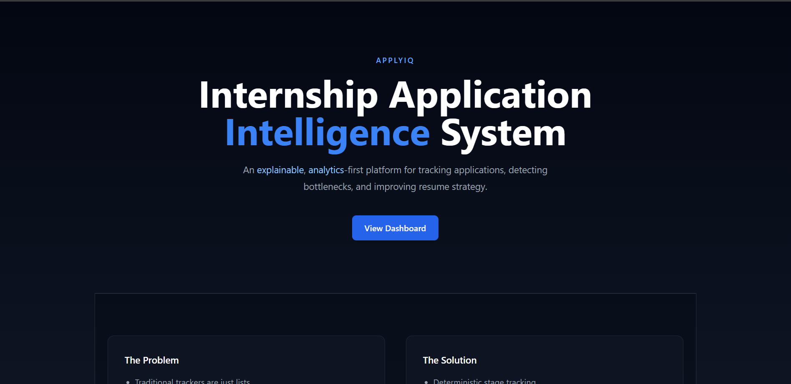
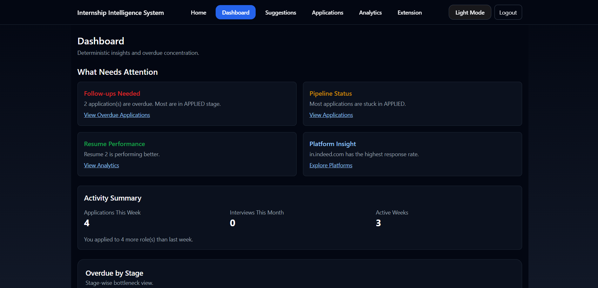
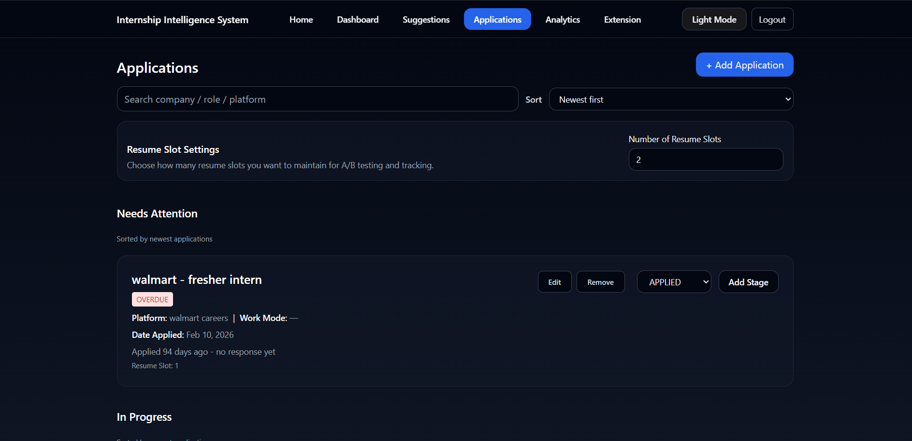
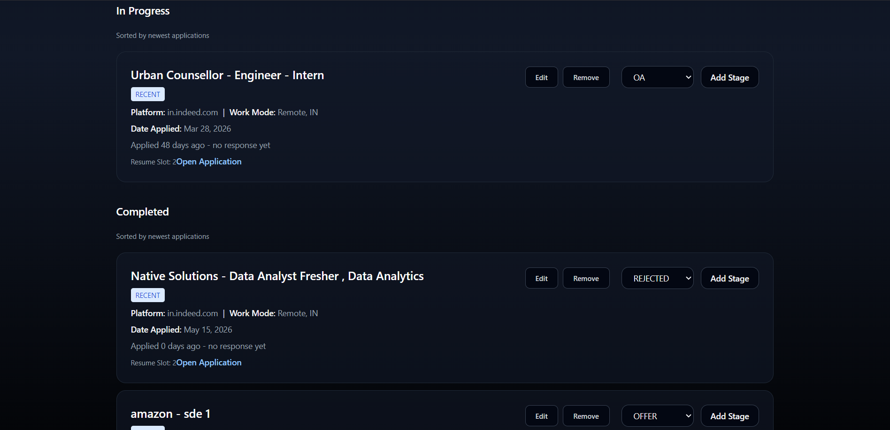
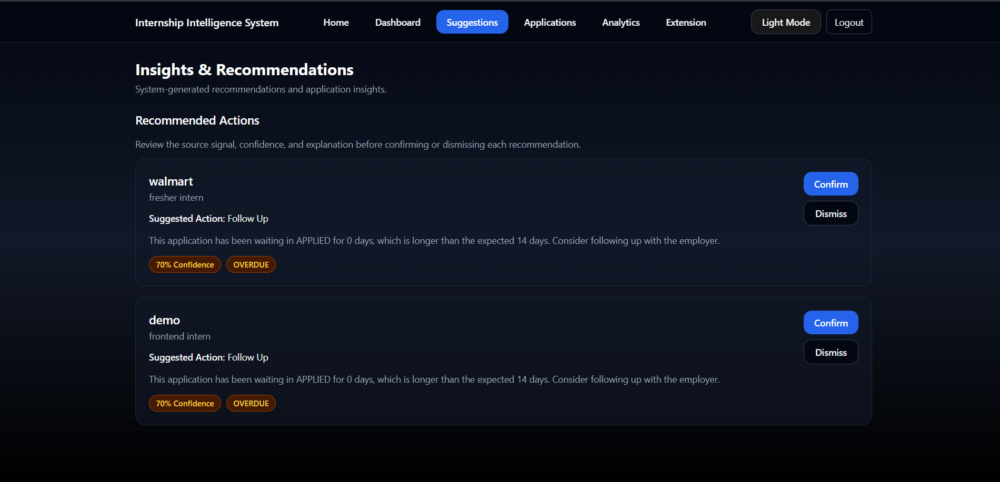
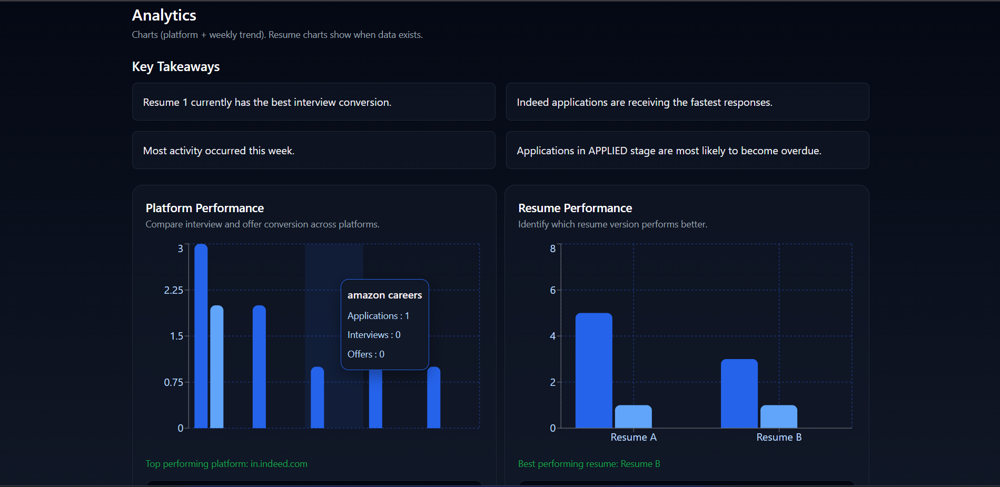
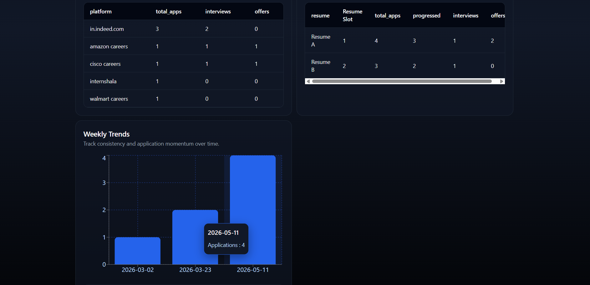
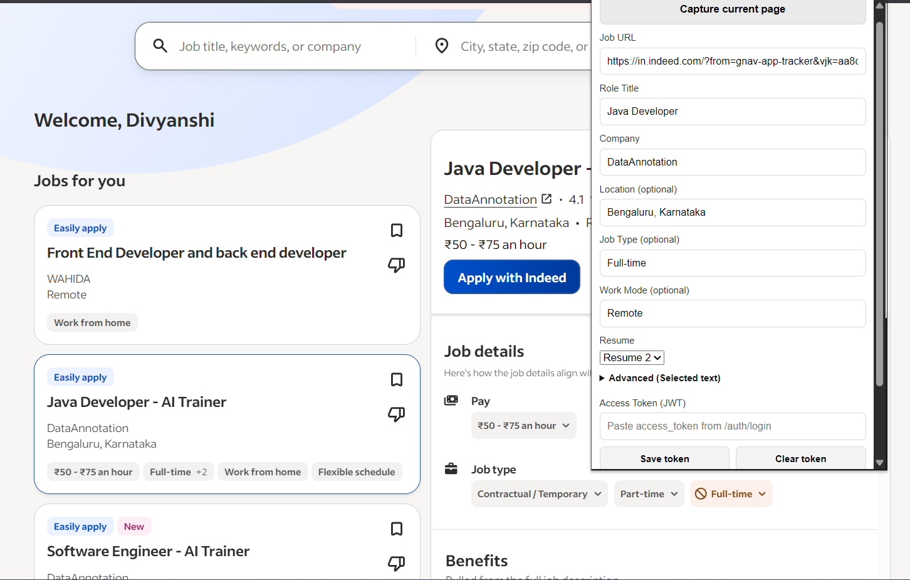
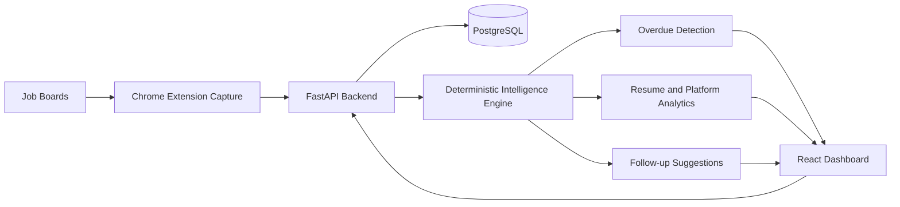

# ApplyIQ - Internship Application Intelligence System

ApplyIQ is an analytics-first internship intelligence platform that captures internship applications, measures resume performance, and surfaces deterministic next-step recommendations. The emphasis is on structured insights and follow-up intelligence, not just CRUD logging.

## Project Overview

ApplyIQ solves the problem of scattershot internship tracking by turning raw application activity into actionable intelligence.

- **Problem it solves:** Internship applications are scattered across platforms and stages, making it hard to see which opportunities are overdue, which resume variant is working, or what follow-up action should be taken next.
- **What makes it different:** Instead of only recording applications, ApplyIQ applies deterministic business logic to expose overdue items, resume performance, platform strengths, and stage transition signals.
- **Deterministic approach:** The platform uses rule-based analytics and confidence-aware signal merging so insights are repeatable, explainable, and auditable.

## System Workflow

**Capture -> Track -> Analyze -> Act**

- **Capture:** Save applications directly from job pages using the Chrome extension or dashboard form.
- **Track:** Maintain structured application records with stages, resume slots, platforms, dates, and follow-up state.
- **Analyze:** Aggregate pipeline health, resume performance, platform response rates, and weekly activity trends.
- **Act:** Surface overdue applications and deterministic next-step recommendations with explainable confidence signals.

## Platform Preview

<p align="center">
  
</p>
<p align="center">
  <sub><strong>Landing page.</strong> Introduces ApplyIQ as an analytics-first internship intelligence system focused on bottleneck detection and resume strategy.</sub>
</p>

<br>

<p align="center">
  
</p>
<p align="center">
  <sub><strong>Dashboard overview.</strong> Highlights overdue detection, pipeline status, resume performance, platform insights, and activity momentum in one decision surface.</sub>
</p>

<br>

<p align="center">
  
</p>
<p align="center">
  <sub><strong>Applications workflow.</strong> Centralized tracking for roles, platforms, resume slots, stage updates, and overdue applications.</sub>
</p>

<p align="center">
  
</p>
<p align="center">
  <sub><strong>Stage management.</strong> Keeps active and completed applications organized so users can maintain a clean recruiting pipeline.</sub>
</p>

<br>

<p align="center">
  
</p>
<p align="center">
  <sub><strong>Suggestions and intelligence.</strong> Converts stalled applications into explainable follow-up actions with confidence and overdue signals.</sub>
</p>

<br>

<p align="center">
  
</p>
<p align="center">
  <sub><strong>Analytics overview.</strong> Compares platform performance and resume outcomes to show where the application strategy is working.</sub>
</p>

<p align="center">
  
</p>
<p align="center">
  <sub><strong>Analytics tables and trends.</strong> Pairs summary tables with weekly activity trends for fast inspection of source quality and application consistency.</sub>
</p>

<br>

<p align="center">
  
</p>
<p align="center">
  <sub><strong>Chrome extension capture.</strong> Extracts job details from live hiring pages so applications can be saved without manual re-entry.</sub>
</p>

## Technical Architecture



- **Frontend:** React + Vite dashboard for application tracking, analytics, suggestions, and workflow operations.
- **Backend:** FastAPI services for authentication, application management, analytics, and recommendation generation.
- **Data layer:** PostgreSQL stores users, applications, resume slots, stage history, and suggestion signals.
- **Automation:** APScheduler runs recurring scans for overdue applications and follow-up intelligence.
- **Extension:** Browser-side capture pipeline extracts job data from live pages and sends structured records to the API.

## Core Features

- **Application tracking**
  - Capture company, role, platform, resume slot, apply date, stage, and follow-up status.
- **Analytics dashboard**
  - Visual overview of overdue items, top platforms, resume performance, and pipeline status.
- **Resume performance analysis**
  - Compare resume variants by interview/offer outcomes and surface the best performing resume slot.
- **Overdue intelligence engine**
  - Detect stalled applications and flag them as high-priority follow-up opportunities.
- **Follow-up recommendations**
  - Generate clear action items when an application needs attention.
- **Status suggestions**
  - Recommend stage updates based on extracted signal data from application portals and emails.
- **Stage history**
  - Track application progression over time and preserve status updates in a structured way.
- **Chrome extension capture system**
  - Capture internship listings directly from browser pages without manual re-entry.
- **Multi-platform extraction architecture**
  - Employs a layered capture strategy for robust job extraction across websites.

## Why Deterministic Instead of AI/LLM?

ApplyIQ was built to prioritize reliable, explainable intelligence over probabilistic model outputs.

- **Explainability:** every recommendation is derived from explicit rules and data sources.
- **Reliability:** deterministic logic avoids unstable behavior from model drift or prompt changes.
- **Structured analytics:** outputs are based on measurable signals such as application age, stage, and resume slot.
- **Controllable logic:** business rules can be tuned directly without retraining or black-box behavior.
- **Reproducibility:** the same inputs produce the same insights every time.

## Extension Intelligence System

The Chrome extension captures internship applications through a layered extraction architecture:

1. **Layer 1: universal extraction**
   - Parses generic DOM fields for broad compatibility across job platforms.
2. **Layer 2: JSON-LD extraction**
   - Extracts structured metadata when available from page schema.
3. **Layer 3: site adapters**
   - Custom extraction rules for target platforms like LinkedIn and other hiring pages.
4. **Confidence-aware merging**
   - Combines candidate values from all layers and selects the most reliable source to build the final application record.

## Analytics & Intelligence Explanation

- **Overdue detection**
  - Identifies applications that have not progressed within an expected timeframe and surfaces them as follow-up priorities.
- **Suggestion generation**
  - Creates status and action recommendations from application signals and stage data.
- **Follow-up recommendations**
  - Translates overdue detection into actionable next steps, not just alerts.
- **Platform performance**
  - Aggregates results by source to show which sites deliver the strongest response rates.
- **Resume performance**
  - Evaluates resume slot success to guide which variant should be used more often.

## Deployment

### Backend production checklist
- Copy `.env.example` to `.env` on the server and set real values for `DATABASE_URL`, `SECRET_KEY`, and `CORS_ORIGINS`.
- Use a long random `SECRET_KEY`; the app refuses the placeholder value when `ENV=production`.
- Run migrations before starting the API: `alembic upgrade head`.
- Start the API with a production ASGI server command such as `uvicorn app.main:app --host 0.0.0.0 --port $PORT`.
- Keep `ADMIN_DEV_ENDPOINTS_ENABLED=false` outside local development.

### Frontend deployment
- Copy `internship-dashboard/.env.example` to `internship-dashboard/.env` and set `VITE_API_BASE_URL` to the deployed backend URL.
- Build with Vite: `cd internship-dashboard && npm install && npm run build`
- Deploy static assets to Netlify, Vercel, S3, or any static hosting service.

### Backend deployment
- Run FastAPI with Uvicorn/Gunicorn
- Use a managed PostgreSQL instance for production
- Configure environment variables for database and authentication secrets
- `Dockerfile` and `Procfile` are included for common container/PaaS deployments.

### Chrome extension deployment
- Update `extension/config.js` so `API_ROOT`, `API_BASES`, and `DASHBOARD_URL` point to the deployed backend/dashboard.
- Keep the extension loaded from the `extension/` directory during local testing.

### Environment setup
- Root `.env` should follow `.env.example`.
- Frontend env should follow `internship-dashboard/.env.example`.

### Local development setup
```bash
python -m venv .venv
.venv\Scripts\activate
pip install -r requirements.txt
uvicorn app.main:app --reload
```

```bash
cd internship-dashboard
npm install
npm run dev
```

```text
# Chrome extension setup
1. Open Chrome to chrome://extensions
2. Enable Developer mode
3. Load unpacked extension from the `extension/` directory
```

